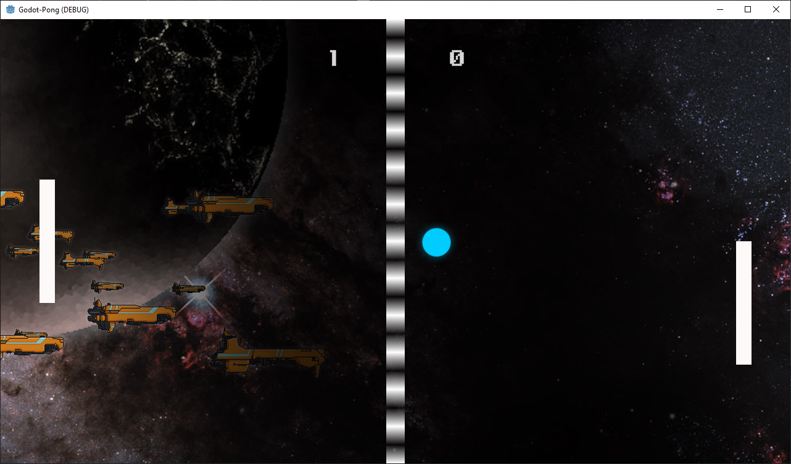

# Godot-Pong
> I am using the Godot game engine to recreate the pong game, I created in The Unity game engine.

## Table of contents
* [General info](#general-info)
* [Screenshots](#screenshots)
* [Technologies](#technologies)
* [Setup](#setup)
* [Features](#features)
* [Status](#status)
* [Inspiration](#inspiration)
* [Contact](#contact)

## General info
I have created  a version of Pong for the Unity game engine. I am going to recreate that Pong game within the Godot game engine so that I can compare and contrast the development process.

I got the assets and code ideas from the following two sites: 

[Make A Pong Game With Unity 2D](https://www.awesomeinc.org/tutorials/unity-pong/ "Make A Pong Game With Unity 2D") and [Unity 2D Pong Game](https://noobtuts.com/unity/2d-pong-game "Unity 2D Pong Game")

The following resources were also useful:

[Godot Docs](https://docs.godotengine.org/en/stable/index.html "Godot Docs")
[Godot C#](https://docs.godotengine.org/en/stable/getting_started/scripting/c_sharp/index.html "Godot C#")
[YouTube Video: Learn Godot by creating Pong](https://www.youtube.com/watch?v=kr1BoEbuveI "Learn Godot by creating Pong")

## Screenshots


## Technologies
* Godot - version 3.2.3.stable.mono.official
* Visual Studio Code - version 1.54.3

## Setup
Clone repository and build.

## Code Examples
Show examples of usage:
```csharp
using Godot;
using System;

public class Ball : KinematicBody2D
{
    float ballSpeed = 600.0f;
    Vector2 ballVelocity = Vector2.Zero;
    private void LaunchBall()
    {
        GD.Randomize();
        int[] randomX = {-1, 1};
        float[] randomY = {-0.8f, 0.8f};

        ballVelocity.x = randomX[GD.Randi() % 2];
        ballVelocity.y = randomY[GD.Randi() % 2];
    }
    public override void _Ready()
    {
        LaunchBall();
    }
    public override void _PhysicsProcess(float delta)
    {
        KinematicCollision2D  ballCollisionObject = 
            MoveAndCollide(ballVelocity * ballSpeed * delta);
            
        if(ballCollisionObject != null)
        {
            ballVelocity = ballVelocity.Bounce(ballCollisionObject.Normal);
        }
    }
}
```

## Features
List of features ready and TODOs for future development
* N/A

To-do list:
* N/A

## Status
Project is: _in progress_

Finding time is harder than you think when you have a full time job.

## Inspiration
Project inspired by...
* [Stack Exchange: Game Development](https://gamedev.stackexchange.com/ "Stack Exchange: Game Development")
* [What are good games to "earn your wings" with?](https://gamedev.stackexchange.com/questions/854/what-are-good-games-to-earn-your-wings-with "What are good games to earn your wings with?")
* [Zaratustra's answer to the question](https://gamedev.stackexchange.com/a/945/9930 "Zaratustra's answer to the question")

based on...
* [Make A Pong Game With Unity 2D](https://www.awesomeinc.org/tutorials/unity-pong/ "Make A Pong Game With Unity 2D")
* [Unity 2D Pong Game](https://noobtuts.com/unity/2d-pong-game "Unity 2D Pong Game")
* [YouTube Video: Learn Godot by creating Pong](https://www.youtube.com/watch?v=kr1BoEbuveI "Learn Godot by creating Pong")

## Contact
Created by [@LordFuture](https://github.com/LordFuture)